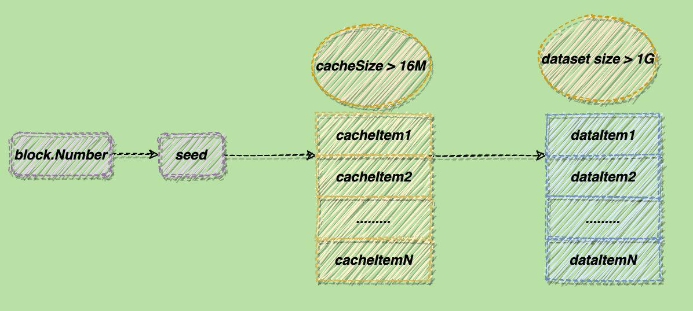

# DataSet

DAG和epoch

1、上面的dataset就来自内存中的一组数据或者硬盘里的DAG。
2、DAG是有向无环图，以太坊的DAG是基于区块高度生成的。
3、以太坊中每3万个块会生成一代DAG，这一代就成称为一个epoch。
4、挖矿的时候需要从DAG中随机选取dataset，所以挖矿工作只能在现世DAG创建以后才能开始。

[官方介绍](https://eth.wiki/concepts/ethash/dag)

> # [¶](https://eth.wiki/concepts/ethash/dag#ethash-dag)Ethash DAG
>
> Ethash is the PoW system. It requires a ~1GB dataset known as the DAG (see [Dagger Hashimoto](https://eth.wiki/concepts/ethash/dag/Dagger-Hashimoto)). This typically takes hours to generate so we tend to memorise it. Clients wishing to store the DAG in a cache should conform to this spec in order to share the cache with other clients:
>
> ## Location
>
> The DAG should be stored in a 1GB dump (for the initial epoch, anyway), in a file:
>
> - Mac/Linux: `$(HOME)/.ethash/full-R<REVISION>-<SEEDHASH>`
> - Windows: `$(HOME)/Appdata/Local/Ethash/full-R<REVISION>-<SEEDHASH>`
>
> Where:
>
> - `<REVISION>` is a decimal integer, given as the C-constant `REVISION` in `libethash/ethash.h`;
> - `<SEEDHASH>` is 16 lowercase hex digits specifying the first 8 bytes of the epoch’s seed hash.
>
> There may be many such DAGs stored in this directory; it is up to the client and/or user to remove out of date ones.
>
> ## Format
>
> Each file should begin with an 8-byte magic number, `0xfee1deadbaddcafe`, written in little-endian format (i.e., bytes `fe ca dd ba ad de e1 fe`).
>
> The Ethash algorithm expects the DAG as a two-dimensional array of uint32s (4-byte unsigned ints), with dimension (n × 16) where n is a large number. (n starts at 16777186 and grows from there.) Following the magic number, the rows of the DAG should be written sequentially into the file, with no delimiter between rows and each unint32 encoded in little-endian format.


`Dagger`算法是用来生成数据集`Dataset`的，核心的部分就是`Dataset`的生成方式和组织结构。

可以把`Dataset`想成多个`item`（**dataItem**）组成的数组，每个`item`是`64`字节的byte数组（一条哈希）。`dataset`的初始大小约为`1G`，每隔3万个区块（一个`epoch`区间）就会更新一次，且每次更新都会比之前变大`8M`左右。

`Dataset`的每个`item`是由一个缓存块（`cache`）生成的，缓存块也可以看做多个`item`（**cacheItem**）组成，缓存块占用的内存要比`dataset`小得多，它的初始大小约为`16M`。同`dataset`类似，每隔 3 万个区块就会更新一次，且每次更新都会比之前变大`128K`左右。

生成一条`dataItem`的程是：从缓存块中“随机”（这里的“随机”不是真的随机数，而是指事前不能确定，但每次计算得到的都是一样的值）选择一个`cacheItem`进行计算，得的结果参与下次计算，这个过程会循环 256 次。

缓存块是由`seed`生成的，而`seed`的值与块的高度有关。所以生成`dataset`的过程如下图所示：



`Dagger`还有一个关键的地方，就是确定性。即同一个`epoch`内，每次计算出来的`seed`、缓存、`dataset`都是相同的。否则对于同一个区块，挖矿的人和验证的人使用不同的`dataset`，就没法进行验证了。

## 生成过程

### 常量定义

```go
const (
	datasetInitBytes   = 1 << 30 // Bytes in dataset at genesis
	datasetGrowthBytes = 1 << 23 // Dataset growth per epoch
	cacheInitBytes     = 1 << 24 // Bytes in cache at genesis
	cacheGrowthBytes   = 1 << 17 // Cache growth per epoch
	epochLength        = 30000   // Blocks per epoch
	mixBytes           = 128     // Width of mix
	hashBytes          = 64      // Hash length in bytes
	hashWords          = 16      // Number of 32 bit ints in a hash
	datasetParents     = 256     // Number of parents of each dataset element
	cacheRounds        = 3       // Number of rounds in cache production
	loopAccesses       = 64      // Number of accesses in hashimoto loop
)

```


### 生成哈希数据集

`generate`函数位于`ethash.go`文件中，主要是为了生成`dataset`,其中包扩以下内容。

```go
func (c *cache) generate(dir string, limit int, lock bool, test bool)
```


#### 生成cache size

`cache size` 主要*某个特定块编号的ethash验证缓存的大小* *， `epochLength` 为 30000，如果`epoch` 小于 2048，则从已知的`epoch`返回相应的`cache size`，否则重新计`epoch`.

`cache`的大小是线性增长的，`size`的值等于(2^24^ + 2^17^ * epoch - 64)，用这个值除以 64 看结果是否是一个质数，如果不是，减去128 再重新计算，直到找到最大的质数为止。

```go
csize := cacheSize(d.epoch*epochLength + 1)
```


```go
func cacheSize(block uint64) uint64 {
	epoch := int(block / epochLength)
	if epoch < maxEpoch {
		return cacheSizes[epoch]
	}
	return calcCacheSize(epoch)
}

func calcCacheSize(epoch int) uint64 {
	size := cacheInitBytes + cacheGrowthBytes*uint64(epoch) - hashBytes
	for !new(big.Int).SetUint64(size / hashBytes).ProbablyPrime(1) { // Always accurate for n < 2^64
		size -= 2 * hashBytes
	}
	return size
}
```


#### 生成dataset size

`dataset Size` 主要*某个特定块编号的ethash验证缓存的大小* , 类似上面生成`cache size`.

```go
dsize := datasetSize(d.epoch*epochLength + 1)

func datasetSize(block uint64) uint64 {
	epoch := int(block / epochLength)
	if epoch < maxEpoch {
		return datasetSizes[epoch]
	}
	return calcDatasetSize(epoch)
}
```

#### 生成 seed 种子

seedHash是用于生成验证缓存和挖掘数据集的种子。*长度为 32。

```go
seed := seedHash(d.epoch*epochLength + 1)

func seedHash(block uint64) []byte {
	seed := make([]byte, 32)
	if block < epochLength {
		return seed
	}
	keccak256 := makeHasher(sha3.NewLegacyKeccak256())
	for i := 0; i < int(block/epochLength); i++ {
		keccak256(seed, seed)
	}
	return seed
}
```

#### 生成cache

```go
generateCache(cache, d.epoch, seed)
```

接下来分析`generateCache`的关键代码：

先了解一下**hashBytes**，在下面的计算中都是以此为单位，它的值为 64 ，相当于一个`keccak512`哈希的长度,下文以**item**称呼`[hashBytes]byte`。

①：初始化`cache`

此循环用来初始化`cache`：先将`seed`的哈希填入`cache`的第一个`item`,随后使用前一个`item`的哈希，填充后一个`item`。

```go
for offset := uint64(hashBytes); offset < size; offset += hashBytes {
		keccak512(cache[offset:], cache[offset-hashBytes:offset])
		atomic.AddUint32(&progress, 1)
	}
```

②：对cache中数据按规则做异或

为对于每一个`item`（`srcOff`），“随机”选一个`item`（`xorOff`）与其进行异或运算；将运算结果的哈希写入`dstOff`中。这个运算逻辑将进行`cacheRounds`次。

两个需要注意的地方：

-  一是`srcOff`是从尾部向头部变化的，而`dstOff`是从头部向尾部变化的。并且它俩是对应的，即当`srcOff`代表倒数第x个item时，`dstOff`则代表正数第x个item。

- 二是`xorOff`的选取。注意我们刚才的“随机”是打了引号的。`xorOff`的值看似随机，因为在给出`seed`之前，你无法知道`xorOff`的值是多少；但一旦`seed`的值确定了，那么每一次`xorOff`的值都是确定的。而`seed`的值是由区块的高度决定的。这也是同一个`epoch`内总是能得到相同`cache`数据的原因。

  ```go
  for i := 0; i < cacheRounds; i++ {
  		for j := 0; j < rows; j++ {
  			var (
  				srcOff = ((j - 1 + rows) % rows) * hashBytes
  				dstOff = j * hashBytes
  				xorOff = (binary.LittleEndian.Uint32(cache[dstOff:]) % uint32(rows)) * hashBytes
  			)
  			bitutil.XORBytes(temp, cache[srcOff:srcOff+hashBytes], cache[xorOff:xorOff+hashBytes])
  			keccak512(cache[dstOff:], temp)
  
  			atomic.AddUint32(&progress, 1)
  		}
  	}
  ```

#### 生成dataset

`dataset`大小的计算和`cache`类似，量级不同：2^30^ + 2^23^ * epoch - 128，然后每次减256寻找最大质数。

 生成数据是一个循环，每次生成64个字节，主要的函数是`generateDatasetItem`：

 `generateDatasetItem`的数据来源就是`cache`数据，而最终的dataset值会存储在mix变量中。整个过程也是由多个循环构成。

 ①：初始化`mix`变量

  根据cache值对`mix`变量进行初始化。其中`hashWords`代表的是一个`hash`里有多少个`word`值：一个`hash`的长度为`hashBytes`即64字节，一个`word`（uint32类型）的长度为 4 字节，因此`hashWords`值为 16。选取`cache`中的哪一项数据是由参数`index`和`i`变量决定的。

  ```go
  mix := make([]byte, hashBytes)
  	binary.LittleEndian.PutUint32(mix, cache[(index%rows)*hashWords]^index)
  	for i := 1; i < hashWords; i++ {
  		binary.LittleEndian.PutUint32(mix[i*4:], cache[(index%rows)*hashWords+uint32(i)])
  	}
  	keccak512(mix, mix)
  ```

②：将`mix`转换成`[]uint32`类型

```go
intMix := make([]uint32, hashWords)
	for i := 0; i < len(intMix); i++ {
		intMix[i] = binary.LittleEndian.Uint32(mix[i*4:])
	}
```

③：将`cache`数据聚合进`intmix`

```go
for i := uint32(0); i < datasetParents; i++ {
		parent := fnv(index^i, intMix[i%16]) % rows
		fnvHash(intMix, cache[parent*hashWords:])
	}
```

`FNV`哈希算法，是一种不需要使用密钥的哈希算法。

这个算法很简单：a乘以FNV质数0x01000193，然后再和b异或。

首先用这个算法算出一个索引值，利用这个索引从`cache`中选出一个值（`data`），然后对`mix`中的每个字节都计算一次`FNV`，得到最终的哈希值。

```go
func fnv(a, b uint32) uint32 {
    return a*0x01000193 ^ b
}
func fnvHash(mix []uint32, data []uint32) {
    for i := 0; i < len(mix); i++ {
        mix[i] = mix[i]*0x01000193 ^ data[i]
    }
}
```

④：将`intMix`又恢复成`mix`并计算`mix`的哈希返回

```go
for i, val := range intMix {
		binary.LittleEndian.PutUint32(mix[i*4:], val)
	}
	keccak512(mix, mix)
	return mix
```

`generateCache`和`generateDataset`是实现`Dagger`算法的核心函数，到此整个生成哈希数据集的的过程结束。