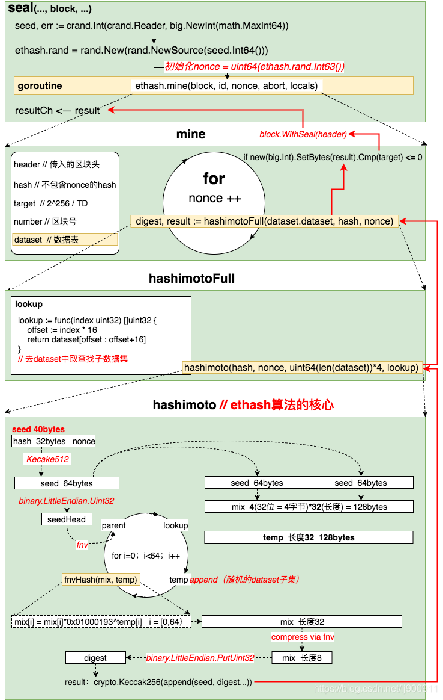

## ETH POW分析

### 共识引擎描述
在CPU挖矿部分，CpuAgent的mine函数，执行挖矿操作的时候调用了self.engine.Seal函数。这里的engine是就是共识引擎。Seal为其中很重要的一个接口。它实现了nonce值的寻找和hash的计算。并且该函数是保证共识并且不能伪造的一个重要的函数。
在PoW共识算法中，Seal函数实现了工作证明。该部分源码在consensus/ethhash下。

### 共识引擎接口

```go
type Engine interface {
	// 获取区块挖掘者, 即coinbase
	Author(header *types.Header) (common.Address, error)


	// VerifyHeader 用于校验区块头，通过共识规则来校验，验证区块可以在这里进行也科通通过VerifySeal方法
	VerifyHeader(chain ChainReader, header *types.Header, seal bool) error


	// VerifyHeaders与VerifyHeader相似,同时这个用于批量操作校验头。这个方法返回一个退出信号
	// 用于终止操作，用于异步校验。
	VerifyHeaders(chain ChainReader, headers []*types.Header, seals []bool) (chan<- struct{}, <-chan error)
	
	// VerifyUncles 用于校验叔块以符合共识引擎的规则
	VerifyUncles(chain ChainReader, block *types.Block) error
	
	// VerifySeal根据共识算法的规则校验区块头
	VerifySeal(chain ChainReader, header *types.Header) error
	
	// Prepare 用于初始化区块头的共识字段根据共识引擎。这些改变都是内联执行的。
	Prepare(chain ChainReader, header *types.Header) error
	
	// Finalize 完成所有的状态修改，并最终组装成块。
	// 区块头和状态数据库在最终确认的时候可以被更新使之符合共识规则。
	Finalize(chain ChainReader, header *types.Header, state *state.StateDB, txs []*types.Transaction,
		uncles []*types.Header, receipts []*types.Receipt) (*types.Block, error)
	
	// Seal 根据输入区块打包生产一个新的区块
	Seal(chain ChainReader, block *types.Block, stop <-chan struct{}) (*types.Block, error)
	
	// CalcDifficulty 是难度调整算法，它返回新的区块的难度值。
	CalcDifficulty(chain ChainReader, time uint64, parent *types.Header) *big.Int
	
	// APIs 返回由共识引擎提供的RPC APIs 
	APIs(chain ChainReader) []rpc.API
}
```

### ethash 实现分析
#### ethash 结构体
```go
type Ethash struct {
	config Config

	// 缓存
	caches   *lru // In memory caches to avoid regenerating too often
	// 内存数据集
	datasets *lru // In memory datasets to avoid regenerating too often

	// Mining related fields
	rand     *rand.Rand    // Properly seeded random source for nonces
	// 挖矿线程数量
	threads  int           // Number of threads to mine on if mining
	// channel 用于更新挖矿通知
	update   chan struct{} // Notification channel to update mining parameters
	hashrate metrics.Meter // Meter tracking the average hashrate

	// 测试网络相关参数
	// The fields below are hooks for testing
	shared    *Ethash       // Shared PoW verifier to avoid cache regeneration
	fakeFail  uint64        // Block number which fails PoW check even in fake mode
	fakeDelay time.Duration // Time delay to sleep for before returning from verify

	lock sync.Mutex // Ensures thread safety for the in-memory caches and mining fields
}
```
Ethash是实现PoW的具体实现，由于要使用到大量的数据集，所有有两个指向lru的指针。并且通过threads控制挖矿线程数。并在测试模式或fake模式下，简单快速处理，使之快速得到结果。

Athor方法获取了挖出这个块的矿工地址。
```go
func (ethash *Ethash) Author(header *types.Header) (common.Address, error) {
	return header.Coinbase, nil
}
```
VerifyHeader 用于校验区块头部信息是否符合ethash共识引擎规则。
```go
// VerifyHeader checks whether a header conforms to the consensus rules of the
// stock Ethereum ethash engine.
func (ethash *Ethash) VerifyHeader(chain consensus.ChainReader, header *types.Header, seal bool) error {
	// 当处于ModeFullFake模式时，任意头部信息都接受
	if ethash.config.PowMode == ModeFullFake {
		return nil
	}
	// 如果该头部是已知的，不用校验，直接返回。
	number := header.Number.Uint64()
	if chain.GetHeader(header.Hash(), number) != nil {
		return nil
	}
	parent := chain.GetHeader(header.ParentHash, number-1)
	if parent == nil {  // 获取父结点失败
		return consensus.ErrUnknownAncestor
	}
	// 进一步进行头部校验
	return ethash.verifyHeader(chain, header, parent, false, seal)
}
```
然后再看看verifyHeader的实现,
```go
func (ethash *Ethash) verifyHeader(chain consensus.ChainReader, header, parent *types.Header, uncle bool, seal bool) error {
	// 确保额外数据段具有合理的长度
	if uint64(len(header.Extra)) > params.MaximumExtraDataSize {
		return fmt.Errorf("extra-data too long: %d > %d", len(header.Extra), params.MaximumExtraDataSize)
	}
	// 校验时间戳
	if uncle {
		if header.Time.Cmp(math.MaxBig256) > 0 {
			return errLargeBlockTime
		}
	} else {
		if header.Time.Cmp(big.NewInt(time.Now().Add(allowedFutureBlockTime).Unix())) > 0 {
			return consensus.ErrFutureBlock
		}
	}
	if header.Time.Cmp(parent.Time) <= 0 {
		return errZeroBlockTime
	}
	// 根据时间戳和父级块的难度校验块的难度。
	expected := ethash.CalcDifficulty(chain, header.Time.Uint64(), parent)

	if expected.Cmp(header.Difficulty) != 0 {
		return fmt.Errorf("invalid difficulty: have %v, want %v", header.Difficulty, expected)
	}
	// 校验gas limit <= 2^63-1
	cap := uint64(0x7fffffffffffffff)
	if header.GasLimit > cap {
		return fmt.Errorf("invalid gasLimit: have %v, max %v", header.GasLimit, cap)
	}
	// 校验 gasUsed <= gasLimit
	if header.GasUsed > header.GasLimit {
		return fmt.Errorf("invalid gasUsed: have %d, gasLimit %d", header.GasUsed, header.GasLimit)
	}

	// gas limit 是否在允许范围内
	diff := int64(parent.GasLimit) - int64(header.GasLimit)
	if diff < 0 {
		diff *= -1
	}
	limit := parent.GasLimit / params.GasLimitBoundDivisor

	if uint64(diff) >= limit || header.GasLimit < params.MinGasLimit {
		return fmt.Errorf("invalid gas limit: have %d, want %d += %d", header.GasLimit, parent.GasLimit, limit)
	}
	// 校验区块号应该是父块区块号 +1
	if diff := new(big.Int).Sub(header.Number, parent.Number); diff.Cmp(big.NewInt(1)) != 0 {
		return consensus.ErrInvalidNumber
	}
	// 校验特定的块是否符合要求
	if seal {
		if err := ethash.VerifySeal(chain, header); err != nil {
			return err
		}
	}
	// 如果所有检查通过，则验证硬分叉的特殊字段。
	if err := misc.VerifyDAOHeaderExtraData(chain.Config(), header); err != nil {
		return err
	}
	if err := misc.VerifyForkHashes(chain.Config(), header, uncle); err != nil {
		return err
	}
	return nil
}
```
Ethash通过CalcDifficulty函数计算下一个区块难度，分别为不同阶段的难度创建了不同的难度计算方法，这里暂不展开描述
```go
func (ethash *Ethash) CalcDifficulty(chain consensus.ChainReader, time uint64, parent *types.Header) *big.Int {
	return CalcDifficulty(chain.Config(), time, parent)
}

func CalcDifficulty(config *params.ChainConfig, time uint64, parent *types.Header) *big.Int {
	next := new(big.Int).Add(parent.Number, big1)
	switch {
	case config.IsByzantium(next):
		return calcDifficultyByzantium(time, parent)
	case config.IsHomestead(next):
		return calcDifficultyHomestead(time, parent)
	default:
		return calcDifficultyFrontier(time, parent)
	}
}
```
VerifyHeaders和VerifyHeader类似，只是VerifyHeaders进行批量校验操作。创建多个goroutine用于执行校验操作，再创建一个goroutine用于赋值控制任务分配和结果获取。最后返回一个结果channel
```go
func (ethash *Ethash) VerifyHeaders(chain consensus.ChainReader, headers []*types.Header, seals []bool) (chan<- struct{}, <-chan error) {
	// If we're running a full engine faking, accept any input as valid
	if ethash.config.PowMode == ModeFullFake || len(headers) == 0 {
		abort, results := make(chan struct{}), make(chan error, len(headers))
		for i := 0; i < len(headers); i++ {
			results <- nil
		}
		return abort, results
	}

	// Spawn as many workers as allowed threads
	workers := runtime.GOMAXPROCS(0)
	if len(headers) < workers {
		workers = len(headers)
	}

	// Create a task channel and spawn the verifiers
	var (
		inputs = make(chan int)
		done   = make(chan int, workers)
		errors = make([]error, len(headers))
		abort  = make(chan struct{})
	)
	// 产生workers个goroutine用于校验头
	for i := 0; i < workers; i++ {
		go func() {
			for index := range inputs {
				errors[index] = ethash.verifyHeaderWorker(chain, headers, seals, index)
				done <- index
			}
		}()
	}

	errorsOut := make(chan error, len(headers))
	// goroutine 用于发送任务到workers个goroutine上
	go func() {
		defer close(inputs)
		var (
			in, out = 0, 0
			checked = make([]bool, len(headers))
			inputs  = inputs
		)
		for {
			select {
			case inputs <- in:
				if in++; in == len(headers) {
					// Reached end of headers. Stop sending to workers.
					inputs = nil
				}
			// 统计结果,并把错误消息发送到errorsOut上
			case index := <-done:
				for checked[index] = true; checked[out]; out++ {
					errorsOut <- errors[out]
					if out == len(headers)-1 {
						return
					}
				}
			case <-abort:
				return
			}
		}
	}()
	return abort, errorsOut
}
```
VerifyHeaders在校验单个区块头的时候使用了verifyHeaderWorker，该函数获取父区块后，调用verifyHeader进行校验
```go
func (ethash *Ethash) verifyHeaderWorker(chain consensus.ChainReader, headers []*types.Header, seals []bool, index int) error {
	var parent *types.Header
	if index == 0 {
		parent = chain.GetHeader(headers[0].ParentHash, headers[0].Number.Uint64()-1)
	} else if headers[index-1].Hash() == headers[index].ParentHash {
		parent = headers[index-1]
	}
	if parent == nil {
		return consensus.ErrUnknownAncestor
	}
	if chain.GetHeader(headers[index].Hash(), headers[index].Number.Uint64()) != nil {
		return nil // known block
	}
	return ethash.verifyHeader(chain, headers[index], parent, false, seals[index])
}

```
VerifyUncles用于叔块的校验。和校验区块头类似，叔块校验在ModeFullFake模式下直接返回校验成功。获取所有的叔块，然后遍历校验，校验失败即终止，或者校验完成返回。
```go
func (ethash *Ethash) VerifyUncles(chain consensus.ChainReader, block *types.Block) error {
	// If we're running a full engine faking, accept any input as valid
	if ethash.config.PowMode == ModeFullFake {
		return nil
	}
	// Verify that there are at most 2 uncles included in this block
	if len(block.Uncles()) > maxUncles {
		return errTooManyUncles
	}
	// 收集叔块及其祖先
	uncles, ancestors := set.New(), make(map[common.Hash]*types.Header)

	number, parent := block.NumberU64()-1, block.ParentHash()
	for i := 0; i < 7; i++ {
		ancestor := chain.GetBlock(parent, number)
		if ancestor == nil {
			break
		}
		ancestors[ancestor.Hash()] = ancestor.Header()
		for _, uncle := range ancestor.Uncles() {
			uncles.Add(uncle.Hash())
		}
		parent, number = ancestor.ParentHash(), number-1
	}
	ancestors[block.Hash()] = block.Header()
	uncles.Add(block.Hash())

	// 校验每个叔块
	for _, uncle := range block.Uncles() {
		// Make sure every uncle is rewarded only once
		hash := uncle.Hash()
		if uncles.Has(hash) {
			return errDuplicateUncle
		}
		uncles.Add(hash)

		// Make sure the uncle has a valid ancestry
		if ancestors[hash] != nil {
			return errUncleIsAncestor
		}
		if ancestors[uncle.ParentHash] == nil || uncle.ParentHash == block.ParentHash() {
			return errDanglingUncle
		}
		if err := ethash.verifyHeader(chain, uncle, ancestors[uncle.ParentHash], true, true); err != nil {
			return err
		}
	}
	return nil
}
```
Prepare实现共识引擎的Prepare接口，用于填充区块头的难度字段，使之符合ethash协议。这个改变是在线的。
```go
func (ethash *Ethash) Prepare(chain consensus.ChainReader, header *types.Header) error {
	parent := chain.GetHeader(header.ParentHash, header.Number.Uint64()-1)
	if parent == nil {
		return consensus.ErrUnknownAncestor
	}
	header.Difficulty = ethash.CalcDifficulty(chain, header.Time.Uint64(), parent)
	return nil
}
```
Finalize实现共识引擎的Finalize接口,奖励挖到区块账户和叔块账户，并填充状态树的根的值。并返回新的区块。
```go
func (ethash *Ethash) Finalize(chain consensus.ChainReader, header *types.Header, state *state.StateDB, txs []*types.Transaction, uncles []*types.Header, receipts []*types.Receipt) (*types.Block, error) {
	// Accumulate any block and uncle rewards and commit the final state root
	accumulateRewards(chain.Config(), state, header, uncles)
	header.Root = state.IntermediateRoot(chain.Config().IsEIP158(header.Number))

	// Header seems complete, assemble into a block and return
	return types.NewBlock(header, txs, uncles, receipts), nil
}

func accumulateRewards(config *params.ChainConfig, state *state.StateDB, header *types.Header, uncles []*types.Header) {
	// Select the correct block reward based on chain progression
	blockReward := FrontierBlockReward
	if config.IsByzantium(header.Number) {
		blockReward = ByzantiumBlockReward
	}
	// Accumulate the rewards for the miner and any included uncles
	reward := new(big.Int).Set(blockReward)
	r := new(big.Int)
	// 奖励叔块账户
	for _, uncle := range uncles {
		r.Add(uncle.Number, big8)
		r.Sub(r, header.Number)
		r.Mul(r, blockReward)
		r.Div(r, big8)
		state.AddBalance(uncle.Coinbase, r)

		r.Div(blockReward, big32)
		reward.Add(reward, r)
	}
	// 奖励coinbase账户
	state.AddBalance(header.Coinbase, reward)
}
```
#### Seal函数实现分析
在CPU挖矿部分，CpuAgent的mine函数，执行挖矿操作的时候调用了Seal函数。Seal函数尝试找出一个满足区块难度的nonce值。
在ModeFake和ModeFullFake模式下，快速返回，并且直接将nonce值取0。
在shared PoW模式下，使用shared的Seal函数。
开启threads个goroutine进行挖矿(查找符合条件的nonce值)。

```go
// Seal implements consensus.Engine, attempting to find a nonce that satisfies
// the block's difficulty requirements.
func (ethash *Ethash) Seal(chain consensus.ChainReader, block *types.Block, stop <-chan struct{}) (*types.Block, error) {
	// 在ModeFake和ModeFullFake模式下，快速返回，并且直接将nonce值取0。
	if ethash.config.PowMode == ModeFake || ethash.config.PowMode == ModeFullFake {
		header := block.Header()
		header.Nonce, header.MixDigest = types.BlockNonce{}, common.Hash{}
		return block.WithSeal(header), nil
	}
	// 在shared PoW模式下，使用shared的Seal函数。
	if ethash.shared != nil {
		return ethash.shared.Seal(chain, block, stop)
	}
	// Create a runner and the multiple search threads it directs
    // 创建一个runner以及它指挥的多重搜索线程

	abort := make(chan struct{})
	found := make(chan *types.Block)

	ethash.lock.Lock()// 线程上锁，保证内存的缓存（包含挖矿字段）安全
	threads := ethash.threads
	if ethash.rand == nil {
        // 获得种子
		seed, err := crand.Int(crand.Reader, big.NewInt(math.MaxInt64))
		if err != nil {
			ethash.lock.Unlock()
			return nil, err
		}
		ethash.rand = rand.New(rand.NewSource(seed.Int64()))// 执行成功，拿到合法种子seed，通过其获得rand对象，赋值。
	}
	ethash.lock.Unlock()
	if threads == 0 {
		threads = runtime.NumCPU()
	}
	if threads < 0 {
		threads = 0 // Allows disabling local mining without extra logic around local/remote
	}
	var pend sync.WaitGroup// 创建一个倒计时锁对象，go语法参照 http://www.cnblogs.com/Evsward/p/goPipeline.html#sync.waitgroup
	for i := 0; i < threads; i++ {
		pend.Add(1)
		go func(id int, nonce uint64) {// 核心代码通过闭包多线程技术来执行。
			defer pend.Done()
			ethash.mine(block, id, nonce, abort, found)// Seal核心工作
		}(i, uint64(ethash.rand.Int63()))//闭包第二个参数表达式uint64(ethash.rand.Int63())通过上面准备好的rand函数随机数结果作为nonce实参传入方法体
	}
	// Wait until sealing is terminated or a nonce is found
	var result *types.Block  // 定义一个区块对象result，用于接收操作结果并作为返回值返回上一层
	select {
	case <-stop:
		// Outside abort, stop all miner threads
		close(abort)
	case result = <-found:
		// One of the threads found a block, abort all others
		close(abort)
	case <-ethash.update:
		// Thread count was changed on user request, restart
		close(abort)
		pend.Wait()
		return ethash.Seal(chain, block, stop)
	}
	// 等待所有的挖矿goroutine返回
	pend.Wait()
	return result, nil
}
```
mine是真正的查找nonce值的函数，它不断遍历查找nonce值，并计算PoW值与目标值进行比较。
其原理可以简述为下：
$$
RAND(h, n)  <=  \frac{M} {d}
$$

这里M表示一个极大的数，这里是 2^256^-1；d表示Header成员Difficulty。RAND()是一个概念函数，它代表了一系列复杂的运算，并最终产生一个类似随机的数。这个函数包括两个基本入参：h是Header的哈希值(Header.HashNoNonce())，n表示Header成员Nonce。整个关系式可以大致理解为，在最大不超过M的范围内，以某个方式试图找到一个数，如果这个数符合条件(<=M/d)，那么就认为Seal()成功。
由上面的公式可以得知，M恒定，d越大则可取范围越小。所以当难度值增加时，挖出区块的难度也在增加。

```go
func (ethash *Ethash) mine(block *types.Block, id int, seed uint64, abort chan struct{}, found chan *types.Block) {
	// 从区块头中获取一些数据
	var (
		header  = block.Header()
		hash    = ethash.SealHash(header).Bytes()
		// target 即查找的PoW的上限 target = maxUint256/Difficulty
		// 其中maxUint256 = 2^256-1  Difficulty即难度值
		target  = new(big.Int).Div(maxUint256, header.Difficulty)
		number  = header.Number.Uint64()
		dataset = ethash.dataset(number)
	)
	// 尝试查找一个nonce值，直到终止或者找到目标值
	var (
		attempts = int64(0)
		nonce    = seed
	)
	logger := log.New("miner", id)
	logger.Trace("Started ethash search for new nonces", "seed", seed)
search:
	for {
		select {
		case <-abort:
			// 终止挖矿
			logger.Trace("Ethash nonce search aborted", "attempts", nonce-seed)
			ethash.hashrate.Mark(attempts)
			break search

		default:
			// 不必在每个nonce值都更新hash rate，每2^x个nonce值更新一次hash rate
			attempts++
			if (attempts % (1 << 15)) == 0 {
				ethash.hashrate.Mark(attempts)
				attempts = 0
			}
			// 用这个nonce计算PoW值
			digest, result := hashimotoFull(dataset.dataset, hash, nonce)
			// 将计算的结果与目标值比较，如果小于目标值，则查找成功。
			if new(big.Int).SetBytes(result).Cmp(target) <= 0 {
				// 查找到nonce值，更新区块头
				header = types.CopyHeader(header)
				header.Nonce = types.EncodeNonce(nonce)
				header.MixDigest = common.BytesToHash(digest)// 将字节数组转换为Hash对象【Hash是32位的根据任意输入数据的Keccak256哈希算法的返回值】

				// 打包区块头并返回
				select {
				// WithSeal 将新的区块头替换旧的区块头
				case found <- block.WithSeal(header):
					logger.Trace("Ethash nonce found and reported", "attempts", nonce-seed, "nonce", nonce)
				case <-abort:
					logger.Trace("Ethash nonce found but discarded", "attempts", nonce-seed, "nonce", nonce)
				}
				break search
			}
			nonce++
		}
	}
	// Datasets are unmapped in a finalizer. Ensure that the dataset stays live
	// during sealing so it's not unmapped while being read.
	runtime.KeepAlive(dataset)
}
```
上述函数调用了hashimotoFull函数用来计算PoW的值。
```go
func hashimotoFull(dataset []uint32, hash []byte, nonce uint64) ([]byte, []byte) {
	lookup := func(index uint32) []uint32 {
		offset := index * hashWords// hashWords是上面定义的常量值= 16
		return dataset[offset : offset+hashWords]
	}
	return hashimoto(hash, nonce, uint64(len(dataset))*4, lookup)
}
```
**lookup** 函数：

非线性查表方式进行的哈希函数。

hashimoto用于聚合数据以产生特定的后部的hash和nonce值。

简述该部分流程:

- 首先，hashimoto()函数将入参@hash和@nonce合并成一个40 bytes长的数组，取它的SHA-512哈希值取名seed，长度为64 bytes。
- 然后，将seed[]转化成以uint32为元素的数组mix[]，注意一个uint32数等于4 bytes，故而seed[]只能转化成16个uint32数，而mix[]数组长度32，所以此时mix[]数组前后各半是等值的。
- 接着，lookup()函数登场。用一个循环，不断调用lookup()从外部数据集中取出uint32元素类型数组，向mix[]数组中混入未知的数据。循环的次数可用参数调节，目前设为64次。每次循环中，变化生成参数index，从而使得每次调用lookup()函数取出的数组都各不相同。这里混入数据的方式是一种类似向量“异或”的操作，来自于**FNV算法**。
待混淆数据完成后，得到一个基本上面目全非的mix[]，长度为32的uint32数组。这时，将其折叠(压缩)成一个长度缩小成原长1/4的uint32数组，折叠的操作方法还是来自**FNV算法**。
- 最后，将折叠后的mix[]由长度为8的uint32型数组直接转化成一个长度32的byte数组，这就是返回值@digest；同时将之前的seed[]数组与digest合并再取一次SHA-256哈希值，得到的长度32的byte数组，即返回值@result。(转自https://blog.csdn.net/metal1/article/details/79682636)
```go
func hashimoto(hash []byte, nonce uint64, size uint64, lookup func(index uint32) []uint32) ([]byte, []byte) {
	// 计算理论行数
	rows := uint32(size / mixBytes)

	// 将 header+nonce into 装换为64字节的seed
	seed := make([]byte, 40)
	copy(seed, hash)// 将区块头的hash（上面提到了Hash对象是32字节大小）拷贝到seed中。
	binary.LittleEndian.PutUint64(seed[32:], nonce) // 将nonce值填入seed的后（40-32=8）字节中去，（nonce本身就是uint64类型，是64位，对应8字节大小），正好把hash和nonce完整的填满了40字节的seed

    seed = crypto.Keccak512(seed)// seed经历一遍Keccak512加密
	seedHead := binary.LittleEndian.Uint32(seed)// 从seed中获取区块头

     // 开始与重复seed的混合
	// 将seed[]转化成以uint32为元素的数组mix[]
	mix := make([]uint32, mixBytes/4)
    // mixBytes常量= 128，mix的长度为32，元素为uint32，是32位，对应为4字节大小。所以mix总共大小为4*32=128字节大小
	for i := 0; i < len(mix); i++ {
		mix[i] = binary.LittleEndian.Uint32(seed[i%16*4:])// 共循环32次，前16和后16位的元素值相同
	}
	// 向mix[]数组中混入未知的数据
	temp := make([]uint32, len(mix))

	for i := 0; i < loopAccesses; i++ {// loopAccesses常量 = 64，循环64次
		parent := fnv(uint32(i)^seedHead, mix[i%len(mix)]) % rows   // mix[i%len(mix)]是循环依次调用mix的元素值
		for j := uint32(0); j < mixBytes/hashBytes; j++ {
			copy(temp[j*hashWords:], lookup(2*parent+j))// 通过用种子seed生成的mix数据进行FNV哈希操作以后的数值作为参数去查找源数据（太绕了）拷贝到temp中去。
		}
		fnvHash(mix, temp) // 将mix中所有元素都与temp中对应位置的元素进行FNV hash运算
	}
	// 压缩成一个长度缩小成原长1/4的uint32数组
	for i := 0; i < len(mix); i += 4 {
		mix[i/4] = fnv(fnv(fnv(mix[i], mix[i+1]), mix[i+2]), mix[i+3])
	}
    // 最后有效数据只在前8个位置，后面的数据经过上面的循环混淆以后没有价值了，所以将mix的长度减到8，保留前8位有效数据。                            
	mix = mix[:len(mix)/4]

	digest := make([]byte, common.HashLength)// common.HashLength=32，创建一个长度为32的字节数组digest
	for i, val := range mix {
		binary.LittleEndian.PutUint32(digest[i*4:], val)// 再把长度为8的mix分散到32位的digest中去。
	}
	return digest, crypto.Keccak256(append(seed, digest...))
}
```


## [以非线性表查找方式进行的哈希运算](https://blog.csdn.net/metal1/article/details/79682636#t7)

#### FNV hash 算法

```go
func fnv(a, b uint32) uint32 {
    return a*0x01000193 ^ b
}
 
func fnvHash(mix []uint32, data []uint32) {
    for i := 0; i < len(mix); i++ {
        mix[i] = mix[i]*0x01000193 ^ data[i]
    }
}
```

0x01000193是FNV hash算法的一个hash质数（Prime number，又叫素数，只能被1和其本身整除），哈希算法会基于一个常数来做散列操作。0x01000193是FNV针对32 bit数据的散列质数。

#### VerifySeal函数实现分析

VerifySeal用于校验区块的nonce值是否满足PoW难度要求。
```go
func (ethash *Ethash) VerifySeal(chain consensus.ChainReader, header *types.Header) error {
	// ModeFake、ModeFullFake模式不校验，直接验证通过。
	if ethash.config.PowMode == ModeFake || ethash.config.PowMode == ModeFullFake {
		time.Sleep(ethash.fakeDelay)
		if ethash.fakeFail == header.Number.Uint64() {
			return errInvalidPoW
		}
		return nil
	}
	// shared PoW下，用shared的校验方法
	if ethash.shared != nil {
		return ethash.shared.VerifySeal(chain, header)
	}
	// Ensure that we have a valid difficulty for the block
	if header.Difficulty.Sign() <= 0 {
		return errInvalidDifficulty
	}
	// 计算digest和PoW值并校验区块头
	number := header.Number.Uint64()

	cache := ethash.cache(number)
	size := datasetSize(number)
	if ethash.config.PowMode == ModeTest {
		size = 32 * 1024
	}
	digest, result := hashimotoLight(size, cache.cache, header.HashNoNonce().Bytes(), header.Nonce.Uint64())
	// Caches are unmapped in a finalizer. Ensure that the cache stays live
	// until after the call to hashimotoLight so it's not unmapped while being used.
	runtime.KeepAlive(cache)

	if !bytes.Equal(header.MixDigest[:], digest) {
		return errInvalidMixDigest
	}
	target := new(big.Int).Div(maxUint256, header.Difficulty)
	// 比较是否满足目标难度要求
	if new(big.Int).SetBytes(result).Cmp(target) > 0 {
		return errInvalidPoW
	}
	return nil
}
```
hashimotoLight和hashimotoFull功能类似，只是hashimotoLight使用了占用内存更小的缓存。
```go
func hashimotoLight(size uint64, cache []uint32, hash []byte, nonce uint64) ([]byte, []byte) {
	keccak512 := makeHasher(sha3.NewKeccak512())

	lookup := func(index uint32) []uint32 {
		rawData := generateDatasetItem(cache, index, keccak512)

		data := make([]uint32, len(rawData)/4)
		for i := 0; i < len(data); i++ {
			data[i] = binary.LittleEndian.Uint32(rawData[i*4:])
		}
		return data
	}
	return hashimoto(hash, nonce, size, lookup)
}
```

其中 **lookup** 函数 与 **hashimofull** 函数中使用的不同。需要注意。





